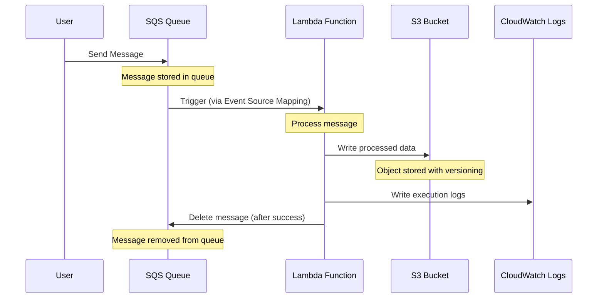
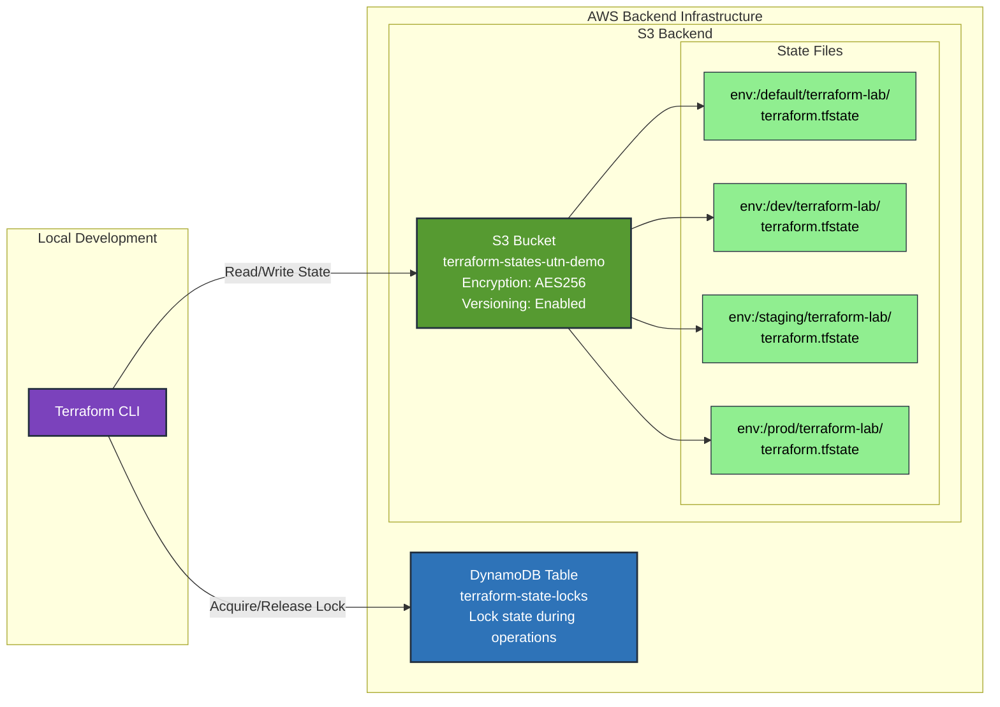
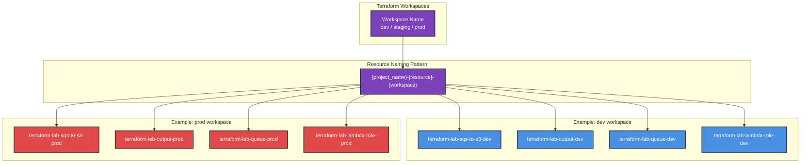

# Architecture Diagram

## AWS Infrastructure

This diagram shows the AWS resources created by this Terraform project and how they interact:

```mermaid
graph TB
    subgraph "AWS Account"
        subgraph "SQS Service"
            SQS[SQS Queue<br/>terraform-lab-queue-{workspace}]
        end

        subgraph "Lambda Service"
            Lambda[Lambda Function<br/>terraform-lab-sqs-to-s3-{workspace}<br/>Runtime: Python 3.12]
            ESM[Event Source Mapping<br/>Batch Size: 1]
        end

        subgraph "S3 Service"
            S3[S3 Bucket<br/>terraform-lab-output-{workspace}<br/>Versioning: Enabled]
        end

        subgraph "IAM Service"
            Role[IAM Role<br/>terraform-lab-lambda-role-{workspace}]
            Policy[IAM Policy<br/>Permissions for Lambda]
        end

        subgraph "CloudWatch Logs"
            Logs[Log Group<br/>Lambda Execution Logs]
        end
    end

    %% Connections
    SQS -->|Triggers| ESM
    ESM -->|Invokes| Lambda
    Lambda -->|Writes Objects| S3
    Lambda -->|Logs| Logs
    Role -->|Attached to| Lambda
    Policy -->|Attached to| Role

    %% Policy permissions
    Policy -.->|Read/Delete Messages| SQS
    Policy -.->|Write Objects| S3
    Policy -.->|Create/Write Logs| Logs

    %% Styling
    classDef sqsStyle fill:#ff9900,stroke:#232f3e,stroke-width:2px,color:#000
    classDef lambdaStyle fill:#ff9900,stroke:#232f3e,stroke-width:2px,color:#000
    classDef s3Style fill:#569a31,stroke:#232f3e,stroke-width:2px,color:#fff
    classDef iamStyle fill:#dd344c,stroke:#232f3e,stroke-width:2px,color:#fff
    classDef logsStyle fill:#b7ca9d,stroke:#232f3e,stroke-width:2px,color:#000

    class SQS sqsStyle
    class Lambda,ESM lambdaStyle
    class S3 s3Style
    class Role,Policy iamStyle
    class Logs logsStyle
```

## Data Flow



## Terraform State Management



## Workspace-based Resource Naming



## IAM Permissions Flow

```mermaid
graph TB
    subgraph "Lambda Function"
        LambdaFunc[Lambda Function<br/>terraform-lab-sqs-to-s3-{workspace}]
    end

    subgraph "IAM Role"
        LambdaRole[IAM Role<br/>terraform-lab-lambda-role-{workspace}]

        subgraph "Attached Policy"
            Policy[IAM Policy<br/>terraform-lab-lambda-policy]

            subgraph "Permissions"
                LogsPerm[CloudWatch Logs<br/>CreateLogGroup<br/>CreateLogStream<br/>PutLogEvents]

                SQSPerm[SQS Queue<br/>ReceiveMessage<br/>DeleteMessage<br/>GetQueueAttributes]

                S3Perm[S3 Bucket<br/>PutObject<br/>PutObjectAcl]
            end
        end
    end

    subgraph "AWS Services"
        CWLogs[CloudWatch Logs]
        SQSQueue[SQS Queue]
        S3Bucket[S3 Bucket]
    end

    LambdaFunc -->|Assumes| LambdaRole
    LambdaRole -->|Has| Policy
    Policy --> LogsPerm
    Policy --> SQSPerm
    Policy --> S3Perm

    LogsPerm -.->|Allows Access| CWLogs
    SQSPerm -.->|Allows Access| SQSQueue
    S3Perm -.->|Allows Access| S3Bucket

    classDef lambdaStyle fill:#ff9900,stroke:#232f3e,stroke-width:2px,color:#000
    classDef iamStyle fill:#dd344c,stroke:#232f3e,stroke-width:2px,color:#fff
    classDef permStyle fill:#ffd700,stroke:#232f3e,stroke-width:1px,color:#000
    classDef serviceStyle fill:#232f3e,stroke:#ff9900,stroke-width:2px,color:#fff

    class LambdaFunc lambdaStyle
    class LambdaRole,Policy iamStyle
    class LogsPerm,SQSPerm,S3Perm permStyle
    class CWLogs,SQSQueue,S3Bucket serviceStyle
```

## Key Features

### Security
- **S3 Bucket Versioning**: Enabled for output bucket to track object history
- **State Encryption**: S3 backend uses AES256 encryption
- **State Locking**: DynamoDB prevents concurrent modifications
- **IAM Least Privilege**: Lambda has only necessary permissions

### Multi-Environment Support
- **Workspaces**: Separate state files per environment (dev, staging, prod)
- **Dynamic Naming**: Resources automatically named based on workspace
- **Isolated Resources**: Each workspace creates independent AWS resources

### Observability
- **CloudWatch Logs**: Automatic logging of Lambda executions
- **SQS Metrics**: Built-in monitoring for queue depth and message age
- **S3 Access Logs**: Can be enabled for audit trails

## Resource Specifications

| Resource | Name Pattern | Configuration |
|----------|-------------|---------------|
| Lambda Function | `{project}-sqs-to-s3-{workspace}` | Runtime: Python 3.12, Timeout: 60s |
| S3 Bucket | `{project}-output-{workspace}` | Versioning: Enabled |
| SQS Queue | `{project}-queue-{workspace}` | Visibility: 300s, Retention: 24h |
| IAM Role | `{project}-lambda-role-{workspace}` | Service: lambda.amazonaws.com |
| Event Source Mapping | N/A | Batch Size: 1, Enabled: true |

## Prerequisites Infrastructure

The backend infrastructure must be deployed first:

| Resource | Name | Purpose |
|----------|------|---------|
| S3 Bucket | `terraform-states-utn-demo` | Store Terraform state files |
| DynamoDB Table | `terraform-state-locks` | Manage state locking |

These are deployed separately using the `prerequisites/` directory and only need to be created once.
